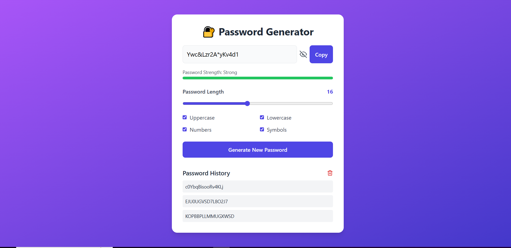

# 🔐 Password Generator — React + Tailwind CSS

A modern, responsive, and feature-rich **Random Password Generator** built using **React.js**, **Tailwind CSS**, and **JavaScript**.  
This project generates secure, customizable passwords with instant copy functionality, a clean UI, and responsive design.

> ⚡ Built with **Vite** for super-fast development.

---

## ✨ Features

- ✅ **Random Password Generation**
- ✅ **Customizable Options**
  - Uppercase letters
  - Lowercase letters
  - Numbers
  - Symbols
  - Adjustable password length (4 to 32)
- ✅ **Copy to Clipboard** with feedback
- ✅ **Clean, Modern UI with Tailwind CSS**
- ✅ **Responsive & Accessible Design**

---

## 📸 Preview



---

## 🛠️ Tech Stack

- **React.js 18**
- **Tailwind CSS 3**
- **Vite**
- **React Icons**
- **JavaScript (ES6)**

---

## 📦 Installation

1. **Clone the repository**

```bash
git clone https://github.com/tanushree-coder-girl/Password-Generator-React.git
cd password-generator-react

npm install

npm run dev
```
